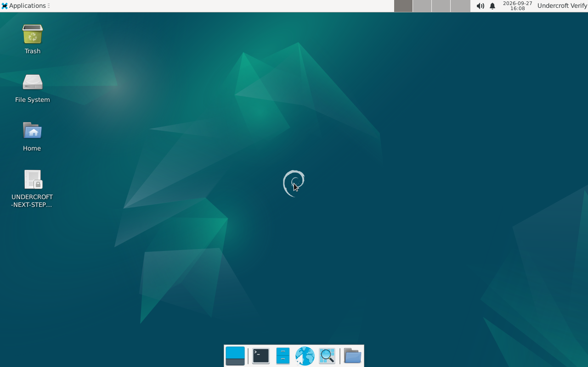

<p align="center">
  
</p>

# Undercroft

**The ground everything else stands on.** Undercroft turns a bare Debian 12 desktop or laptop into a ready-to-go appliance station for the [Citadel](https://github.com/frankprobst5-stack/Project-Citadel) / [WayStation](https://github.com/frankprobst5-stack/WayStation) ecosystem — Docker installed and running unattended, radio hardware permissions and tooling already in place, a real Xfce desktop, and a first-boot handoff straight into Citadel's own installer.

It's the OS layer, not an app: install it once on the machine that's going to run your station, and everything else in the ecosystem just works on top of it.

<p align="center">
  
</p>

---

## Status: source release, build-it-yourself

There's no downloadable installer image on this repo's Releases page — Undercroft produces a real ISO, and a live-build+Calamares image is too large and too build-specific (kernel/firmware versions drift constantly) to ship as a static download. Instead, you build it from source, which takes about an hour the first time and is fully scripted.

This is early: Undercroft Full (the desktop/laptop tier this repo covers) is real, hands-on tested, and verified end-to-end — a completed install boots standalone, Docker comes up active with no one logged in, and the radio tooling (Direwolf, JS8Call, Pat, rtl-sdr, hamlib) is present and on `PATH`. What's honestly still open:

- **Undercroft Lite (Raspberry Pi 4/5)** hasn't been started — this repo is Full only for now.
- **The boot-console QR display, the laptop lid-switch fix, and the GPS/chrony time stanza** are all written and installed, but only verified in a virtual machine so far — real hardware testing is still needed.
- **No code-signing/notarization** — this is a Linux ISO built from a script you can read yourself, not a signed vendor image.

See [ROADMAP.md](ROADMAP.md) for the full, honestly-tagged build log — what's verified, what's simulated, what's still just planned.

## Requirements

- An x86-64 desktop or laptop, and a blank USB stick (8GB+) to install from.
- **Debian 12 (bookworm)** as the base — the full ISO installer (Option A below) installs Debian for you from scratch; the alternative path (Option B) provisions an existing Debian 12 machine in place.
- Real internet access during the build/install itself (it's pulling several hundred real packages); the whole point of the result is that it doesn't need that afterward.

## Getting it

**Option A — build a bootable installer ISO** (recommended for a fresh machine):

```bash
cd sandbox
mkdir -p build-output
docker run --rm --privileged \
    -v "$(pwd)/build-output":/output \
    -v "$(pwd)/build-iso.sh":/build-iso.sh:ro \
    -v "$(pwd)/../brand":/brand:ro \
    debian:12-slim bash /build-iso.sh
```

This produces `sandbox/build-output/undercroft-sandbox.iso` — a real Debian 12 + Xfce + Calamares live image with Docker, the radio stack, and Undercroft's own hardening already baked in. Flash it to a USB stick (`dd`, Rufus, Balena Etcher, whatever you're used to) and boot the target machine from it; Calamares walks you through the rest.

Before writing it to real hardware, you can also boot it in the same QEMU/noVNC sandbox this project uses for its own testing — see [sandbox/README.md](sandbox/README.md).

**Option B — provision an existing Debian 12 install in place:**

```bash
git clone https://github.com/frankprobst5-stack/Undercroft.git
cd Undercroft
sudo ./provision.sh
```

Use this if you've already got Debian 12 installed the normal way and just want Undercroft's own layer (Docker, radio permissions, the Xfce Workstation profile, the branded desktop, hardware hooks) added on top.

Either way, provisioning ends by handing off to Citadel's own installer — `cd ~/citadel && ./install.sh` — which is where you pick which Citadel modules actually run.

## What it sets up

- **Docker Engine**, installed via the real official `docs.docker.com` repo and enabled to survive a reboot with no one logged in — this is what Citadel itself runs on.
- **Radio-ready permissions and tooling**: `dialout`/`plugdev` group membership, `rtl-sdr`'s own udev rules, and Direwolf/JS8Call/Pat/hamlib pre-installed for WayStation's local-hardware modules.
- **A real Xfce desktop** (Workstation profile) with Firefox ESR standing in for [Gated](https://github.com/frankprobst5-stack/Gated) until that project has real code, and the Citadel Ecosystem crest as the desktop background.
- **A no-keyboard boot console**: mDNS hostname, IP, and a scannable QR to the Citadel dashboard, printed on every real boot.
- **Laptop-specific behavior** (only applied if a battery is detected): ignores the lid switch so the station keeps serving while closed.
- An inert, ready-to-activate **GPS time stanza** for offline-capable clock sync — just needs a real USB GPS plugged in.

## License

GPL-3.0-or-later — see [LICENSE](LICENSE). This covers Undercroft's own scripts (`provision.sh`, everything under `sandbox/`) only. Debian itself and every package it installs (Docker, Xfce, Direwolf, JS8Call, Pat, etc.) are pulled from their own upstream repositories and keep their own licenses, unmodified and uncombined with this project's code.
